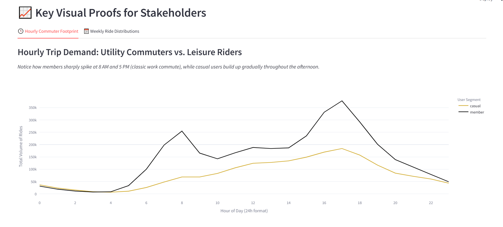
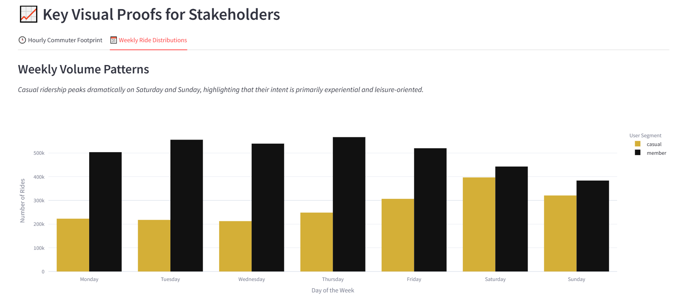

# Cyclistic Bike-Share Analytics: Behavioral Optimization & Membership Conversion

Link to Live Interactive Dashboard: [👉 View Live Dashboard Here](https://cyclistic-bike-share.streamlit.app/)

## 📌 Executive Bugt siness Case & Problem Statement
Cyclistic’s financial viability relies heavily on high-margin annual memberships. The objective of this study is to perform deep behavioral diagnosis on customer segments (**Casual Riders** vs. **Annual Members**) to isolate exactly why, when, and how casual riders use the fleet. 

Instead of a generic blanket marketing plan, this repository outlines a targeted conversion framework built on empirical trip patterns, helping marketing executives pitch annual plans to casual users based on financial tipping points and behavioral footprints.

## 🛠️ The Technical Stack & Pipeline
- **Data Engineering & ETL:** Python 3.x (`Pandas`, `NumPy`) used inside Jupyter Notebook to clean historical structures, handle time-series metrics, filter out system anomalies, and extract specific attributes (`day_of_week`, `hour`).
- **Business Intelligence App:** Built with `Streamlit` and `Plotly Express` to deploy a responsive, executive-facing analytical dashboard.

---

## 📊 Strategic Data Proofs & Diagnostics

### 1. The Commuter vs. Leisure Footprint (Hourly Analysis)
*Annual members exhibit sharp usage spikes tightly aligned with standard corporate commuting hours (8:00 AM and 5:00 PM), functioning purely as an operational transit utility. Casual riders, conversely, show a gradual afternoon build-up, indicating experiential and leisure-driven intent.*



### 2. The Weekend Overlap (Weekly Analysis)
*Casual ridership dramatically dominates Saturday and Sunday trends, surpassing member volumes. This visually confirms that casual users treat the service as a recreational luxury.*



---

## 🎯 Target Marketing Directives
Based on the computed data thresholds in this analysis, the marketing team should move forward with three high-conversion initiatives:

1. **The 'Weekend Warrior' Pass Campaign:** Launch seasonal promotions immediately preceding summer peaks targeting heavy weekend users. Frame the annual membership not as a daily work commute tool, but as the ultimate financial asset for leisure and wellness.
2. **Automated Tipping-Point In-App Triggers:** Implement behavioral features in the mobile application. The moment a casual user completes a single trip crossing the 25-minute margin, trigger a calculation showing them exactly how much capital they would save by moving into an annual subscription model.
3. **Geofenced Corporate Transit Ads:** Focus digital ad spend around high-volume, structural corporate corridors during the 8 AM and 5 PM slots where single-ride casual users are currently mimicking commuting patterns but paying single-use premiums.

---

## 📂 Repository Structure
```text
├── data/                           # Cleaned analytics-ready dataset
├── notebooks/                      # Python engineering, transformation, and processing notebooks
├── visuals/                        # Static dashboard export benchmarks for reporting
├── app.py                          # Core Streamlit business intelligence script
└── README.md                       # Executive presentation summary
